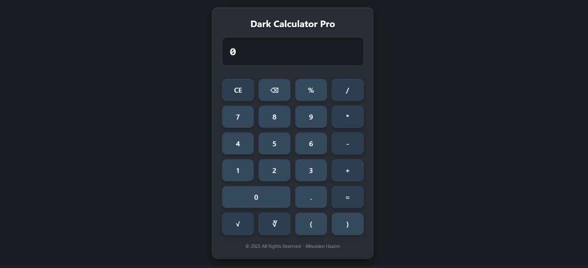

# 🧮 Dark Calculator Pro - Advanced Scientific Calculator

## 📸 Calculator Preview

<div align="center">



</div>

<div align="center">

> *Professional dark-themed scientific calculator with advanced mathematical functions and elegant UI design*

</div>

---

## 📋 Table of Contents
- [📋 Project Overview](#-project-overview)
- [✨ Features](#-features)
- [🛠️ Technologies Used](#️-technologies-used)
- [📁 Project Structure](#-project-structure)
- [🎨 Design Features](#-design-features)
- [🚀 Getting Started](#-getting-started)
- [🎯 Key Features](#-key-features)
- [🧮 Calculator Functions](#-calculator-functions)
- [📱 User Experience](#-user-experience)
- [🌟 Special Thanks](#-special-thanks)

---

## 📋 Project Overview

**Dark Calculator Pro** is a sophisticated, dark-themed scientific calculator built entirely with vanilla JavaScript and DOM manipulation. This project showcases advanced mathematical operations, elegant UI design, and professional calculator functionality without external dependencies. Perfect for developers, students, and professionals who need a powerful calculation tool.

---

## ✨ Features

### 🎯 **Advanced Mathematical Operations**
- Basic arithmetic operations (+, -, *, /)
- Square root (√) and cube root (∛) functions
- Power calculations (x^y)
- Percentage calculations
- Complex expression evaluation
- Parentheses support for order of operations

### 🎨 **Professional User Interface**
- Dark theme with modern color scheme
- Responsive button grid layout
- Smooth hover effects and animations
- Professional typography and spacing
- Elegant shadows and borders

### 🧮 **Scientific Calculator Functions**
- Square root with complex expressions
- Cube root with complex expressions
- Power function with iterative calculation
- Error handling for invalid expressions
- Memory-efficient calculation system

### 📱 **User Experience Features**
- Clear display with left-aligned text
- Backspace functionality for corrections
- Clear entry (CE) button
- Responsive button feedback
- Professional animations and transitions

### 🚀 **Technical Excellence**
- Pure vanilla JavaScript implementation
- DOM manipulation and dynamic styling
- Event-driven architecture
- Cross-browser compatibility
- No external dependencies

---

## 🛠️ Technologies Used

- **HTML5** - Semantic structure and input elements
- **Vanilla JavaScript** - DOM manipulation and calculator logic
- **CSS-in-JS** - Dynamic styling with JavaScript
- **Modern UI/UX** - Professional calculator design
- **Responsive Design** - Adaptive layout system

---

## 📁 Project Structure

```
AlhussienHazem-Task-9/
├── index.html          # Main calculator interface
├── script.js           # Calculator logic and UI
├── style.css           # Additional styling (if any)
└── README.md           # This file
```

---

## 🎨 Design Features

- **Dark Theme** - Professional dark color scheme
- **Modern UI** - Clean, organized button layout
- **Interactive Elements** - Hover effects and smooth transitions
- **Professional Typography** - Clear, readable display
- **Elegant Shadows** - Depth and visual hierarchy
- **Responsive Layout** - Adapts to different screen sizes

---

## 🚀 Getting Started

1. **Clone the repository**
   ```bash
   git clone https://github.com/alhussienhazem/dark-calculator-pro.git
   ```

2. **Navigate to the project directory**
   ```bash
   cd AlhussienHazem-Task-9
   ```

3. **Open in your browser**
   - Open `index.html` in your web browser
   - Start calculating with the professional interface
   - Test advanced functions like square root and powers

---

## 🎯 Key Features

- ✅ **Scientific Functions** - Square root, cube root, powers
- ✅ **Complex Expressions** - Parentheses and order of operations
- ✅ **Professional UI** - Dark theme with modern design
- ✅ **Error Handling** - Graceful handling of invalid input
- ✅ **Pure JavaScript** - No external dependencies
- ✅ **Responsive Design** - Works on all screen sizes
- ✅ **Advanced Math** - Professional calculation capabilities

---

## 🧮 Calculator Functions

| Function | Symbol | Description |
|----------|--------|-------------|
| **Addition** | `+` | Standard addition with decimal support |
| **Subtraction** | `-` | Standard subtraction operations |
| **Multiplication** | `*` | Product calculations |
| **Division** | `/` | Division with error handling |
| **Percentage** | `%` | Automatic division by 100 |
| **Square Root** | `√` | Calculate square root of numbers or expressions |
| **Cube Root** | `∛` | Calculate cube root of numbers or expressions |
| **Power** | `^` | Raise numbers to any power |
| **Parentheses** | `()` | Control order of operations |
| **Decimal Point** | `.` | Support for fractional numbers |
| **Clear Entry** | `CE` | Reset calculator to initial state |
| **Backspace** | `⌫` | Remove last entered character |
| **Equals** | `=` | Execute calculations and display results |

---

## 📱 User Experience

### 🎨 **Visual Design**
- **Dark theme** - Professional dark color scheme
- **Button grid** - Organized 4-column layout
- **Display area** - Large, clear input/output display
- **Hover effects** - Interactive feedback on buttons
- **Smooth animations** - Professional transitions

### 🧮 **Calculation Flow**
1. **Input numbers** - Type numbers and operators
2. **Use functions** - Apply square root, cube root, or powers
3. **Complex expressions** - Use parentheses for order control
4. **Get results** - Press equals for instant calculation
5. **Error handling** - Clear feedback for invalid input

### 🎯 **Learning Benefits**
- **DOM manipulation** - Creating and styling elements dynamically
- **Event handling** - Click events and user interactions
- **Mathematical logic** - Complex calculation algorithms
- **CSS-in-JS** - Dynamic styling with JavaScript
- **Professional UI/UX** - Calculator interface design principles

---

## 🌟 Special Thanks

- **Instructor Badr** - For assigning this comprehensive calculator development task
- **Modern web standards** - For enabling powerful DOM manipulation
- **Vanilla JavaScript** - For robust calculation capabilities
- **Mathematical functions** - For inspiring advanced calculator features

---

*Built with ❤️ for learning advanced calculator development and professional UI design principles*
