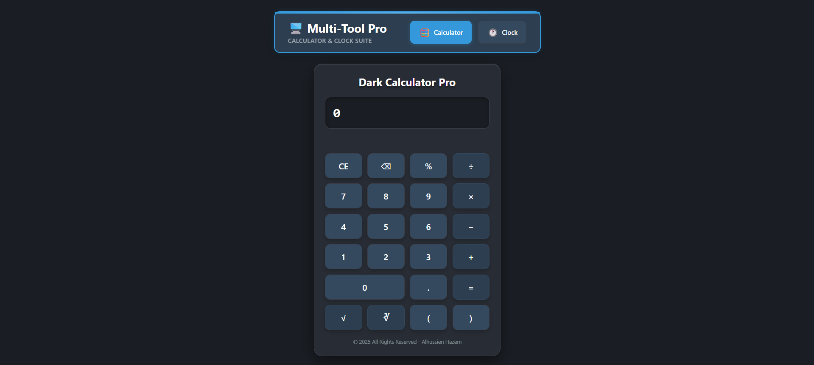
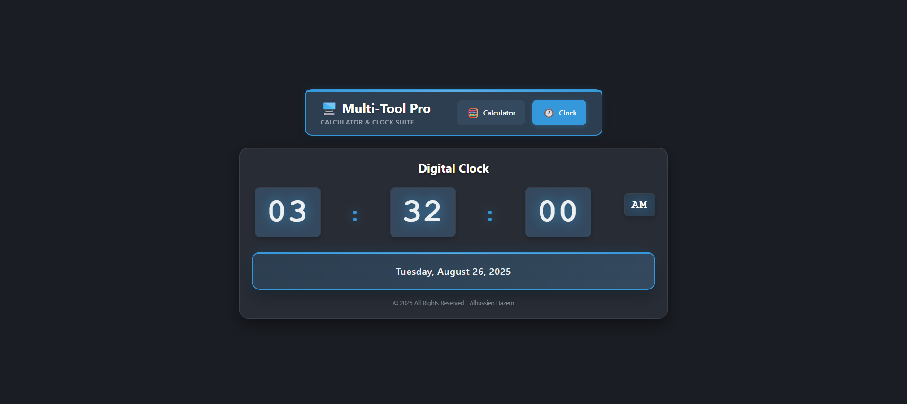

# 🧮 Calculator & Clock Pro - Advanced Scientific Calculator & Digital Clock

## 📸 Project Showcase

<div align="center">

### 🧮 Calculator Interface


### 🕐 Digital Clock Interface  


</div>

<div align="center">

> *Professional dark-themed scientific calculator with advanced math functions and elegant digital clock interface*

</div>

---

## 📋 Table of Contents
- [📋 Project Overview](#-project-overview)
- [✨ Features](#-features)
- [🛠️ Technologies Used](#️-technologies-used)
- [📁 Project Structure](#-project-structure)
- [🎨 Design Features](#-design-features)
- [🚀 Getting Started](#-getting-started)
- [🎯 Key Features](#-key-features)
- [🧮 Calculator Functions](#-calculator-functions)
- [🕐 Clock Features](#-clock-features)
- [📱 User Experience](#-user-experience)
- [🌟 Special Thanks](#-special-thanks)

---

## 📋 Project Overview

**Calculator & Clock Pro** is a sophisticated, dark-themed scientific calculator with an integrated digital clock, built entirely with vanilla JavaScript, HTML5, and CSS3. This project showcases advanced mathematical operations, elegant UI design, professional calculator functionality, and a real-time digital clock interface without external dependencies. Perfect for developers, students, and professionals who need a powerful calculation tool with timekeeping capabilities.

---

## ✨ Features

### 🎯 **Advanced Mathematical Operations**
- Basic arithmetic operations (+, -, ×, ÷)
- Square root (√) and cube root (∛) functions
- Power calculations (x^y)
- Percentage calculations
- Complex expression evaluation
- Parentheses support for order of operations
- Live result preview
- Error handling for division by zero

### 🕐 **Digital Clock System**
- Real-time 12-hour format display
- AM/PM indicator
- Full date display (day, month, year)
- Automatic updates every second
- Professional dark theme styling

### 🎨 **Professional User Interface**
- Dark theme with modern color scheme
- Responsive button grid layout
- Smooth hover effects and animations
- Professional typography and spacing
- Elegant shadows and borders
- Interactive navigation between calculator and clock

### 🧮 **Scientific Calculator Functions**
- Square root with complex expressions
- Cube root with complex expressions
- Power function with iterative calculation
- Error handling for invalid expressions
- Memory-efficient calculation system
- Live calculation preview

### 📱 **User Experience Features**
- Clear display with left-aligned text
- Backspace functionality for corrections
- Clear entry (CE) button
- Responsive button feedback
- Professional animations and transitions
- Seamless switching between calculator and clock views
- Error state management

### 🚀 **Technical Excellence**
- Pure vanilla JavaScript implementation
- Clean separation of concerns (HTML, CSS, JS)
- Event-driven architecture
- Cross-browser compatibility
- No external dependencies
- Responsive design principles

---

## 🛠️ Technologies Used

- **HTML5** - Semantic structure, input elements, and navigation
- **CSS3** - Advanced styling, animations, and responsive design
- **Vanilla JavaScript** - DOM manipulation, calculator logic, and clock functionality
- **Modern UI/UX** - Professional calculator and clock design
- **Responsive Design** - Adaptive layout system for all screen sizes

---

## 📁 Project Structure

```
calculator-clock-pro/
├── index.html              # Main interface with calculator and clock
├── script.js               # Calculator logic, clock functions, and navigation
├── style.css               # Complete styling for both calculator and clock
├── README.md               # This file
├── images/                 # Project images and assets
│   ├── calculator-showcase.png  # Calculator preview image
│   ├── clock-showcase.png       # Clock preview image
│   └── favicon.png             # Website favicon
```

---

## 🎨 Design Features

- **Dark Theme** - Professional dark color scheme throughout
- **Modern UI** - Clean, organized button layout and clock display
- **Interactive Elements** - Hover effects and smooth transitions
- **Professional Typography** - Clear, readable displays
- **Elegant Shadows** - Depth and visual hierarchy
- **Responsive Layout** - Adapts to different screen sizes
- **Navigation Bar** - Professional horizontal navigation between views
- **Consistent Styling** - Unified design language across both interfaces

---

## 🚀 Getting Started

1. **Clone the repository**
   ```bash
   git clone https://github.com/alhussienhazem/calculator-clock-pro.git
   ```

2. **Open in your browser**
   - Open `index.html` in your web browser
   - Use the navigation bar to switch between calculator and clock
   - Start calculating with the professional interface
   - View the real-time digital clock

---

## 🎯 Key Features

- ✅ **Scientific Functions** - Square root, cube root, powers
- ✅ **Complex Expressions** - Parentheses and order of operations
- ✅ **Professional UI** - Dark theme with modern design
- ✅ **Error Handling** - Graceful handling of invalid input
- ✅ **Pure JavaScript** - No external dependencies
- ✅ **Responsive Design** - Works on all screen sizes
- ✅ **Advanced Math** - Professional calculation capabilities
- ✅ **Digital Clock** - Real-time 12-hour format display
- ✅ **Live Preview** - Instant calculation results
- ✅ **Navigation System** - Seamless switching between views

---

## 🧮 Calculator Functions

| Function | Symbol | Description |
|----------|--------|-------------|
| **Addition** | `+` | Standard addition with decimal support |
| **Subtraction** | `−` | Standard subtraction operations |
| **Multiplication** | `×` | Product calculations |
| **Division** | `÷` | Division with error handling |
| **Percentage** | `%` | Automatic division by 100 |
| **Square Root** | `√` | Calculate square root of numbers or expressions |
| **Cube Root** | `∛` | Calculate cube root of numbers or expressions |
| **Power** | `^` | Raise numbers to any power |
| **Parentheses** | `()` | Control order of operations |
| **Decimal Point** | `.` | Support for fractional numbers |
| **Clear Entry** | `CE` | Reset calculator to initial state |
| **Backspace** | `⌫` | Remove last entered character |
| **Equals** | `=` | Execute calculations and display results |

---

## 🕐 Clock Features

| Feature | Description |
|---------|-------------|
| **Time Display** | Real-time 12-hour format (HH:MM:SS) |
| **AM/PM Indicator** | Automatic AM/PM display |
| **Date Display** | Full date (e.g., "Tuesday, August 26, 2025") |
| **Auto-Update** | Updates every second automatically |
| **Professional Styling** | Matches calculator design theme |
| **Responsive Layout** | Adapts to different screen sizes |

---

## 📱 User Experience

### 🎨 **Visual Design**
- **Dark theme** - Professional dark color scheme
- **Button grid** - Organized 4-column layout for calculator
- **Clock display** - Large, clear time and date display
- **Navigation bar** - Professional horizontal navigation
- **Hover effects** - Interactive feedback on all elements
- **Smooth animations** - Professional transitions throughout

### 🧮 **Calculation Flow**
1. **Input numbers** - Type numbers and operators
2. **Use functions** - Apply square root, cube root, or powers
3. **Complex expressions** - Use parentheses for order control
4. **Live preview** - See results in real-time
5. **Get final results** - Press equals for complete calculation
6. **Error handling** - Clear feedback for invalid input

### 🕐 **Clock Experience**
1. **Real-time display** - Always current time and date
2. **12-hour format** - Familiar AM/PM time display
3. **Professional styling** - Consistent with calculator theme
4. **Automatic updates** - No manual refresh needed

### 🎯 **Learning Benefits**
- **DOM manipulation** - Working with existing HTML elements
- **Event handling** - Click events and user interactions
- **Mathematical logic** - Complex calculation algorithms
- **Time management** - Date object and interval handling
- **Professional UI/UX** - Calculator and clock interface design principles
- **Code organization** - Clean separation of HTML, CSS, and JavaScript

---

## 🌟 Special Thanks

- **Instructor Badr** - For assigning this comprehensive calculator and clock development task
- **Modern web standards** - For enabling powerful DOM manipulation and CSS3 features
- **Vanilla JavaScript** - For robust calculation and timekeeping capabilities
- **Mathematical functions** - For inspiring advanced calculator features
- **Time and date APIs** - For enabling professional clock functionality

---

*Built with ❤️ for learning advanced calculator development, digital clock implementation, and professional UI design principles*
